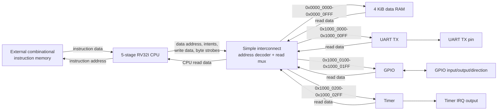

# RV32I Mini-SoC

RV32I Mini-SoC is a compact, readable SystemVerilog implementation of a
32-bit RISC-V system intended for architecture study, RTL interviews, and
small FPGA-oriented experiments. The repository includes both a single-cycle
reference core and a five-stage pipelined core, then integrates the pipelined
core with RAM and three memory-mapped peripherals.

The pipelined implementation includes EX/MEM and MEM/WB forwarding, load-use
hazard detection with a one-cycle stall, and branch/jump redirect handling with
younger-instruction flushing. The complete SoC adds a 4 KiB data RAM, TX-only
UART, bidirectional GPIO register block, and compare timer behind a simple
zero-wait-state interconnect.

## Architecture



The instruction interface is intentionally exposed at the SoC boundary. This
keeps the processor independent of ROM initialization and lets a testbench,
FPGA ROM, or board-specific memory supply instructions without changing the
CPU. The data side uses byte addresses and a single-cycle combinational read
path; writes commit on the rising clock edge.

See [Architecture notes](docs/architecture.md) for the detailed pipeline and
integration behavior.

## CPU architecture

The reference core executes one instruction at a time and provides a simple
baseline for checking decode and architectural behavior. The integrated core
uses the classic five-stage pipeline:

| Stage | Main work |
| --- | --- |
| IF | Present the PC to instruction memory and capture the returned instruction. |
| ID | Decode, generate immediates, and read the integer register file. |
| EX | Select forwarded operands, execute the ALU, and resolve branches/jumps. |
| MEM | Perform formatted byte, halfword, or word loads and stores. |
| WB | Write ALU, load, or PC+4 results back to the register file. |

Forwarding selects the newest available matching result from EX/MEM or MEM/WB
for both ALU operands and store data. A load result is not available soon enough
for the immediately following dependent instruction, so the hazard unit holds
PC and IF/ID for one cycle and injects a bubble into ID/EX. Other ordinary ALU
dependencies proceed without a stall.

Branches, `JAL`, and `JALR` resolve in EX. A taken redirect replaces the fetch
PC and invalidates both younger pipeline slots in IF/ID and ID/EX. Redirects
take priority over a simultaneous younger load-use stall request.

## Design Highlights

- Two CPU implementations make architectural behavior easy to compare before
  discussing pipeline performance and control complexity.
- Forwarding covers both operands and store data, including newest-producer
  priority and the hardwired-zero register corner case.
- Hazard handling distinguishes load results from EX-ready ALU results and
  inserts only the bubble required by a true load-use dependency.
- Redirect logic explicitly flushes younger work, preventing wrong-path
  register writes and memory stores.
- Byte-lane strobes remain intact from CPU store formatting through the
  interconnect to RAM and peripherals.
- The self-checking SoC test runs real hand-encoded RV32I instructions and
  observes effects at external pins and memory, rather than forcing internal
  control signals.
- The same top-level design passes simulation and generic Yosys synthesis with
  inferred RAM and register-file memories preserved.

## Memory map

| Region | Address range | Size |
| --- | --- | ---: |
| Data RAM | `0x0000_0000`–`0x0000_0FFF` | 4 KiB |
| UART | `0x1000_0000`–`0x1000_00FF` | 256 B |
| GPIO | `0x1000_0100`–`0x1000_01FF` | 256 B |
| Timer | `0x1000_0200`–`0x1000_02FF` | 256 B |

Unmapped reads return zero. Unmapped writes select no target and have no effect.
Slave addresses are translated to offsets relative to the selected region.

## Peripheral registers

### UART TX

| Offset | Register | Access | Description |
| --- | --- | --- | --- |
| `0x00` | TXDATA | Write | Writing bits `[7:0]` with byte strobe 0 starts transmission while idle. Writes while busy are ignored. |
| `0x04` | STATUS | Read | Bit 0 is `busy`; other bits are zero. |

Frames contain one low start bit, eight data bits LSB first, and one high stop
bit. The clock divider is the integer value `CLOCK_FREQ_HZ / UART_BAUD_RATE`.

### GPIO

| Offset | Register | Access | Description |
| --- | --- | --- | --- |
| `0x00` | GPIO_OUT | Read/write | Output value; writes honor byte strobes. |
| `0x04` | GPIO_IN | Read | Current external input value; writes are ignored. |
| `0x08` | GPIO_DIR | Read/write | Direction mask; `1` selects output and `0` selects input. |

`GPIO_WIDTH` is parameterizable from 1 to 32 and defaults to 32. Reset clears
GPIO_OUT and GPIO_DIR.

### Timer

| Offset | Register | Access | Description |
| --- | --- | --- | --- |
| `0x00` | COUNT | Read | Free-running 32-bit count while enabled; writes are ignored. |
| `0x04` | COMPARE | Read/write | Compare value; writes honor all four byte strobes. |
| `0x08` | CONTROL | Read/write | Bit 0 `enable`; bit 1 `irq_enable`. |
| `0x0C` | STATUS | Read/W1C | Bit 0 `pending`; write one with byte strobe 0 to clear. |

While enabled, COUNT increments every clock. Equality with COMPARE sets the
sticky pending bit, and `timer_irq_o = pending && irq_enable`. Reset clears all
timer state.

## Verification

The regression contains 12 self-checking SystemVerilog testbenches with 2,491
explicit checks. It covers ALU and decode units, register file and immediate
generation, both CPU cores, RAM byte lanes, every interconnect region and
boundary, UART framing, parameterized GPIO, timer behavior, and full-SoC
execution.

| Testbench | Checks | Main coverage |
| --- | ---: | --- |
| `tb_alu` | 20 | RV32I arithmetic, logical, comparison, and shift operations |
| `tb_regfile` | 5 | Dual reads, writes, overwrite behavior, and x0 |
| `tb_imm_gen` | 8 | Immediate formats and sign extension |
| `tb_control_unit` | 18 | Decode and control generation |
| `tb_rv32i_core_singlecycle` | 9 | Reference-core instruction execution |
| `tb_rv32i_core_pipeline` | 28 | Forwarding, stalls, redirects, flushes, and memory formatting |
| `tb_data_ram` | 16 | Full, byte, and halfword writes with preservation |
| `tb_simple_interconnect` | 1,536 | Region boundaries, routing, muxing, and unmapped accesses |
| `tb_uart_tx` | 581 | Framing, timing, busy behavior, strobes, and status |
| `tb_gpio` | 183 | Widths 32/13/1, strobes, direction, input, and reset |
| `tb_timer` | 77 | Counting, compare, pending, IRQ masking, clearing, and reset |
| `tb_rv32i_mini_soc` | 10 | End-to-end program execution and memory-mapped I/O |

The SoC integration program stores and reloads RAM, consumes the loaded value
through a dependent instruction, writes GPIO_OUT and GPIO_DIR, sends UART byte
`0x55` with externally sampled framing, configures the timer, observes IRQ, and
reads timer STATUS back through the CPU into RAM.

Run the complete regression from the repository root:

```text
python scripts/sim.py
```

Icarus Verilog (`iverilog` and `vvp`) must be available on `PATH`. More detail is
available in [Verification notes](docs/verification.md).

## Synthesis

The checked-in Yosys flow reads the complete SoC source list in dependency
order, selects `rv32i_mini_soc` as the top, performs technology-independent
coarse synthesis, preserves inferred memories, runs structural checks, and
writes a generic JSON netlist.

```text
yosys -l reports/yosys_synthesis.log -s scripts/synth.ys
```

| Metric | Result |
| --- | ---: |
| Generic cells | 395 |
| Mux/priority-mux cells | 129 |
| Equality comparators | 75 |
| Synchronous flip-flop groups | 61 |
| Generic ALU cells | 8 |
| Inferred memories | 2 |
| Inferred memory capacity | 33,792 bits |
| Structural-check problems | 0 |

The inferred memories are the 1,024×32 data RAM and 32×32 CPU register file.
These are generic synthesis results. They do not provide technology-mapped
timing, physical area, power, placement, routing, or bitstream results. See the
[synthesis report](reports/synthesis_report.md) and
[raw statistics](reports/yosys_stat.txt).

## Project structure

```text
rtl/
  cpu/                    # Packages, datapath blocks, reference and pipeline cores
  memory/data_ram.sv      # 4 KiB byte-writeable data RAM when integrated
  bus/simple_interconnect.sv
  peripherals/            # UART TX, GPIO, and timer
  rv32i_mini_soc.sv       # Complete integration top
tb/                       # Self-checking unit, core, peripheral, and SoC tests
scripts/
  sim.py                  # Portable full-regression runner
  synth.ys                # Reusable generic Yosys synthesis flow
docs/
  architecture.md         # Pipeline and SoC integration details
  verification.md         # Coverage and end-to-end test details
reports/
  synthesis_report.md     # Reviewed synthesis summary
  yosys_stat.txt          # Raw Yosys hierarchy/cell statistics
  yosys_synthesis.log     # Complete synthesis log
```

## Current limitations

- The data bus and memories are zero-wait-state; there is no ready/valid or
  back-pressure protocol.
- Instruction memory is an external combinational interface.
- Exceptions, traps, CSRs, privileged behavior, and system instructions are not
  implemented.
- Misaligned accesses are assumed absent and are not trapped or repaired.
- Timer IRQ is exposed at the SoC boundary but is not consumed by the CPU.
- UART is transmit-only and has no FIFO or interrupt.
- UART baud generation uses integer division and may have quantization error.
- There is no instruction or data cache.
- Synthesis is generic only; a target-specific flow is still required for
  timing closure, physical resource results, and implementation.
