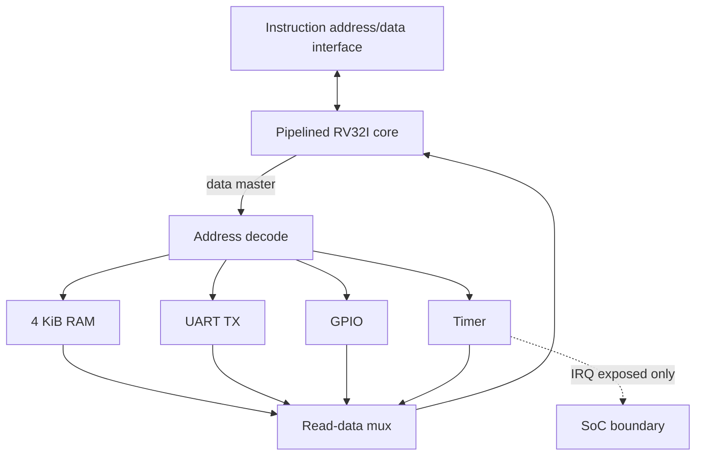
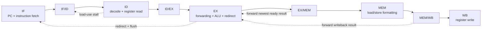

# Architecture notes

## System integration

`rv32i_mini_soc` integrates the pipelined core, interconnect, 4 KiB data RAM,
UART transmitter, GPIO block, and timer. The instruction-memory interface stays
at the top level, while every CPU data access passes through the interconnect.

The CPU presents a byte address, read and write intents, 32-bit write data, and
four byte strobes. Address decode produces one target select and target-qualified
read/write signals. The selected slave's combinational read data returns through
the read mux. An unmapped address selects no slave; its reads return zero and its
writes have no effect.

## Pipeline state flow

### IF and ID

The fetch PC resets to zero and advances by four unless a redirect or stall
overrides it. Instruction memory is combinational from the core's perspective.
IF/ID records the fetched instruction and its PC. ID performs control decode,
immediate generation, and two register-file reads. A WB-to-ID bypass covers the
clock edge where writeback and decode reference the same register.

### EX and forwarding

ID/EX holds decoded control, operands, source/destination indices, immediate,
and instruction PC. The forwarding unit independently selects each EX operand
from its captured value, EX/MEM, or MEM/WB. EX/MEM has priority because it is the
newer producer. ALU results and PC+4 are forwardable from EX/MEM; load data is
not available until MEM/WB. Store data uses the same forwarded source path.

EX also resolves all conditional branches, `JAL`, and `JALR`. `JALR` clears the
least-significant target bit as required by the ISA.

### Load-use stalls

The hazard unit detects an instruction in ID that consumes the destination of a
valid load currently in EX. On a match, PC and IF/ID hold their values and ID/EX
is replaced by an invalid bubble. Older EX/MEM and MEM/WB work continues, making
the load result available for forwarding on the following cycle. Destination
register x0 and source fields unused by an opcode do not cause false stalls.

### Redirect and flush

A taken branch or jump in EX redirects the PC and invalidates IF/ID and ID/EX.
This removes the two younger wrong-path instructions before either can update
architectural state. Redirect handling has priority over a simultaneous stall
request from a younger instruction. Older instructions continue through MEM and
WB.

### MEM and WB

MEM derives byte position from address bits `[1:0]`. Loads shift the selected
byte or halfword to bit zero and apply signed or unsigned extension. Stores shift
source data into its addressed lane and generate the corresponding byte strobes.
Word operations use all four lanes. Natural alignment is assumed.

MEM/WB captures ALU, memory, and PC+4 candidates. The decoded writeback source
selects the value written to the register file; writes to x0 are suppressed.

## Clocking and reset model

CPU pipeline registers and peripheral state update on the rising clock edge.
The CPU, UART, GPIO, and timer use synchronous active-high reset. Data RAM and
the integer register array have no initialization reset; software or the
testbench must write locations before relying on their contents. Reads from the
data RAM, register file, interconnect, and peripheral register interfaces are
combinational.

## Integration boundaries

- `instruction_address_o` and `instruction_data_i` connect to an external
  combinational instruction source.
- `uart_tx_o` is the serialized TX pin and idles high.
- `gpio_in_i`, `gpio_out_o`, and `gpio_dir_o` expose register-level GPIO signals;
  pad tristates and input synchronizers are board-specific.
- `timer_irq_o` exposes the timer interrupt condition. The current CPU has no
  trap or interrupt entry path.
